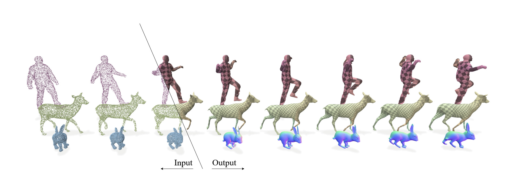

# Preconditioned Deformation Grids


## Linux Install
```
git submodule update --init

conda create -n T python=3.12
conda activate T


pip install ext/pcgrid
pip install torch==2.6.0 torchvision==0.21.0 torchaudio==2.6.0 --index-url https://download.pytorch.org/whl/cu126
pip install tqdm tensorboard scikit-learn charonload cmake gpytoolbox imageio matplotlib ninja open3d opencv-python pykdtree trimesh pymeshlab openmesh tensorboardx
pip install "git+https://github.com/facebookresearch/pytorch3d.git"
```

## Main.py Arguments
```
python Main.py --...
[-m / --methocConfig] - Path to the method config file (str)
[-se / --seed] - random seed (int)
[-d / --device] - cuda device number (int)
[-t / --target] - which target type to use. If pcl is chosen, make sure that the directory path is as configured in the AMA dataset. ("pcl"/"obj")
[-np / --number_points] - if [-t == "obj"] set the number of target points sampled per obj file (int)
[-o / --out_path] - output directory (str)
[-dp / --directory_path] - path to the input objects, see PATH-STRUCTURE section (str)
[-s / --skip] - how many objects to skip (int)
```

## PATH-STRUCTURE
To download the preprocessed data, see the data section of [Dynosurf](https://github.com/yaoyx689/DynoSurf?tab=readme-ov-file).
``` 
--AMA

----crane_0010

------gt
------pcl_seqs
------points_clouds

----crane_0027

------gt
------pcl_seqs
------points_clouds
```

## RUNS
All run configs are predefined in configs/method/runs. For the ablation study see the configs/method/ablations path. Alter the path arguments accordingly [-o / -dp]
``` 
[AMA] python configs/method/runs/run_ama.py
[DT4D] python configs/method/runs/run_dt4d.py
[DFAUST] python configs/method/runs/run_dfaust.py
```

To run the sequence length ablation studies, use the scripts in src/io/dataset/process_[___]_dataset.py to prepare the input data. These scripts have been tested and demonstrated on the AMA dataset. Please note that the code has been refactored, so results may differ slightly from those reported in the paper. The noise ablation study is currently not re-enabled.
To run the initialization methods from DynoSurf or Motion2VecSets, make sure to install their required packages. For Motion2VecSets, we recommend creating a separate conda environment with the appropriate Python version to avoid version conflicts.

